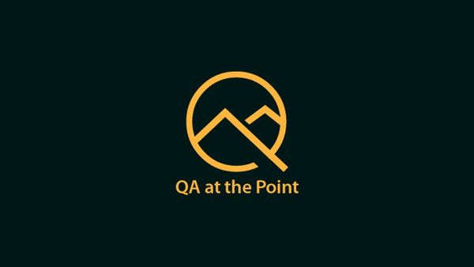
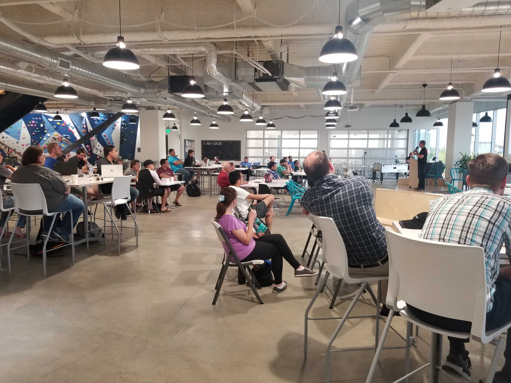

QAP is a brand and business with a very simple vision:

> Provide as much value to the QA Community as possible because we believe the rising tide raises all ships.

It may sound vague, but if the QA Community is the customer, then we have to listen to their feedback and questions so we know what value we need to provide. It becomes an initiative that is "for the community, by the community".

To do this, we have multiple campaigns:

#### Monthly Meetup

I wanted to solve the issues and problems I experienced from the other meetups and tech communities, but I knew I couldn't do it alone.

I started by creating a group of people that were responsible for the monthly meetup. This group is called the [Council of the Test](https://www.qap.dev/leadership).

I was able to delegate different aspects of the meetup while having a group to collaborate and share ideas with. For example, having someone focused on the attendees' experience solved issues that I would have never thought of.

Something else we do is have multiple presentations and workshops every month instead of just a single presentation. This gives us the ability to target different audiences. In August of 2019, we had two presentations:

1. QA Architects presented and demoed about how they used performance testing and processes in production to catch issues and be proactive with optimizations.
2. QA Director presented how they use AI in software at their company and how attendees could use it right then so they could take it home and play some more.

Every attendee was able to take something valuable away regardless of experience or title. With two presentations and a possible workshop every month, there is sure to be something just for you.

You can find more about the QAP meetup on [Meetup.com](https://www.meetup.com/QA-at-the-Point/) or at [QAP.dev](https://qap.dev)

#### Autobots
Coding is hard and takes a lot of time and practice. It's impossible for someone to do a demo for an hour or two and expect attendees to grasp everything and be able to execute the next day. That style is great to present a technique or tool, but doing that once per month at the meetup would take way too long to level up.

Again, I want to provide as much value to the community as possible and knew that meeting more frequently with a programming-only focus would be the answer.

I solved this by creating a weekly programming group called Autobots. We get together every week to code for 2 hours! This gives each autobot a safe space to learn, ask questions, and practice. We then give out challenges for them to complete throughout the week until we meet again.

You get personal mentors, instructors, and a group of awesome people that also want to learn test automation with you.

#### Find and Train for Jobs
Autobots was the perfect way for us to provide an _almost_ guaranteed job.

I teamed up with the Software Technology Group (STG) to provide certifications and trainings to Autobots. Attendees would go through a structured curriculum week after week. Writing code, completing challenges, and getting it reviewed by members of STG not only gives them feedback that they can use as they are job hunting, but STG said that anyone who completes these certifications are automatically qualified to work for STG!

We already have attendees that have gone through the training, gotten the certifications, and now code for STG as full-time Automation Engineers on salary.

We also team up with many companies, recruiters and agencies to promote software testing positions and opportunities in our community - sometimes exclusively!

#### Community Tutorials and Resources
> "For the community, by the community."

We have many amazing companies and individuals here in Utah and we want to brag about them, give them shout outs, and share their work with the rest of the community and the world.

We provide the platform, connections and influencers to help those individuals that are looking to get their networking, blog, YouTube series, etc. to the next level.

It's one of the reasons we have a formal papercall application for people who want to present at the meetup. It's great practice!

This campaign also includes our own tutorials and resources that we create.

Check out my [Test Automation in Python](https://www.youtube.com/watch?v=tGzyAoVU1Ks&list=PLelD030IW7swU6n75wOIeCC9hqKipub_w) course on my YouTube channel [Kidman Media Group](https://www.youtube.com/channel/UCNvYBOCETf7MByrYKDTU3fQ).

## What's next?

QAP is still young and growing. We have many goals and changes that are already planned and incoming, but we truly want your feedback for what we can do to improve and continue to provide value for you.

We're excited for the future and love hearing the success stories from the community and how QAP was part of that.

#### Resources

[QAP Website at qap.dev](https://qap.dev)

[QAP Meetup Page](https://www.meetup.com/QA-at-the-Point/)

[Kidman Media Group YouTube Channel](https://www.youtube.com/channel/UCNvYBOCETf7MByrYKDTU3fQ)
