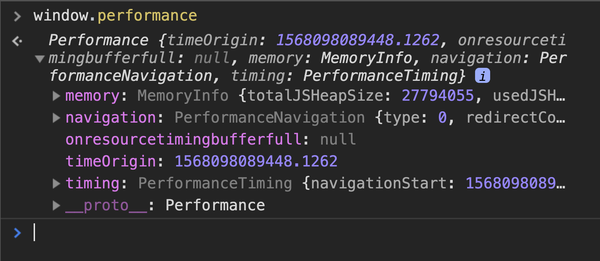

Performance testing is a very powerful pillar in the overall testing strategy. However, I see many companies either do this really far in their pipelines or not in their pipelines at all. They may have something that runs every night or week, or they have to manually kick-off a "performance suite", but it's usually an afterthought.

This approach "works", but it's not continuous and is not "shift left". We want to catch and report bugs and issues as early in the pipeline as possible, which is why bundling tests can be super valuable.

In one of my presentations at QA at the Point, I talked about how much data is generated by a Selenium test, but none of it is ever used. In this article, I want to show you how you can leverage the browser's PerformanceTiming objects and gather the metrics within them so you can actually report and measure the UI's performance.


#### The Stack
* Python with Pytest
* Selenium

## Where do these metrics come from?

Selenium is not a tool that does performance testing, but it's what we'll be using to traverse pages, like a user would, to gather performance metrics from the browser.

We will be leveraging a W3C Browser Specification called the [Performance Navigation Timing API](https://developer.mozilla.org/en-US/docs/Web/API/PerformanceNavigationTiming).


## First Look at the Data

1. Open a browser (I'm using Chrome)
2. Navigate to https://qap.dev
3. Open the DevTools Console (F12)
4. Enter the following into the console:
```javascript
window.performance
```

You should see an object like this:



This object can be very misleading because it looks like the one we'd be working with, but this is the **PerformanceTiming API** and is deprecated. It's just there for backwards compatability so don't use it.

Instead, we are going to be getting 3 different **Performance Entry** objects:

1. Paint Timing
2. Resources
3. Navigation Timing

## Paint Timing

Enter this into the console:

```javascript
window.performance.getEntriesByName("first-contentful-paint")[0];
```

The object you get back will look like:

```javascript
// PerformancePaintTiming
{
    "duration": 0,
    "entryType": "paint",
    "name": "first-contentful-paint",
    "startTime": 1452.8449999634176
}
```

This is your first metric! The **First Contentful Paint** is how long it takes for the majority of the content to be fully rendered and consumable by the user.

The `startTime` is the amount of time it took and is represented as a **High Resolution Timestamp**. This is in milliseconds with the remainder being microseconds. Now that's precision!


## Resources

Enter this into the console:

```javascript
window.performance.getEntriesByType("resource");
```

This is a list of all of the requests that were sent for this page. Open one of them up and you'll see that it's bigger than our Paint object.

```javascript
// PerformanceResourceTiming
{
    "connectEnd": 724.455000134185,
    "connectStart": 724.455000134185,
    "decodedBodySize": 5158,
    "domainLookupEnd": 724.455000134185,
    "domainLookupStart": 724.455000134185,
    "duration": 2.839999971911311,
    "encodedBodySize": 574,
    "entryType": "resource",
    "fetchStart": 724.455000134185,
    "initiatorType": "link",
    "name": "https://fonts.googleapis.com/css?family=Fjalla"
    "nextHopProtocol": "http/2+quic/46",
    "redirectEnd": 0,
    "redirectStart": 0,
    "requestStart": 725.7650000974536,
    "responseEnd": 727.2950001060963,
    "responseStart": 726.9600001163781,
    "secureConnectionStart": 0,
    "serverTiming": [],
    "startTime": 724.455000134185,
    "transferSize": 0,
    "workerStart": 0
}
```

Notice how the `duration` is small compared to other values like `fetchStart`? That's because `duration` is the amount of time it took, but other values like **requestStart** and **responseEnd** are timestamps.

Possible metrics include:
* **number of requests**
* **request time** - The time it took to send the request to the server and get a response back. We could calculate that with `responseEnd - requestStart`

## Navigation Timing

Enter this into the console:

```javascript
window.performance.getEntriesByType("navigation")[0];
```

You get back:

```javascript
{
    "connectEnd": 466.98000002652407,
    "connectStart": 274.24499997869134,
    "decodedBodySize": 63938,
    "domComplete": 2469.8050001170486,
    "domContentLoadedEventEnd": 1517.3299999441952,
    "domContentLoadedEventStart": 1497.1900000236928,
    "domInteractive": 1492.6500001456589,
    "domainLookupEnd": 274.24499997869134,
    "domainLookupStart": 274.0849999245256,
    "duration": 2473.6600001342595,
    "encodedBodySize": 12663,
    "entryType": "navigation",
    "fetchStart": 21.584999980404973,
    "initiatorType": "navigation",
    "loadEventEnd": 2473.6600001342595,
    "loadEventStart": 2469.8300000745803,
    "name": "https://www.qap.dev/",
    "nextHopProtocol": "h2",
    "redirectCount": 0,
    "redirectEnd": 0,
    "redirectStart": 0,
    "requestStart": 467.1350000426173,
    "responseEnd": 679.6900001354516,
    "responseStart": 677.5950000155717,
    "secureConnectionStart": 0,
    "serverTiming": [],
    "startTime": 0,
    "transferSize": 12930,
    "type": "navigate",
    "unloadEventEnd": 0,
    "unloadEventStart": 0,
    "workerStart": 0
}
```

Looks close to our Resource objects, but now we have we have an entire `dom` section as well!

## Use Selenium

Now that we have seen the information in the browser's console manually, it's time to use Selenium to get this data into our code.

#### Get the Timing Objects

I usually have a `lib` or `framework` directory with a selenium subdirectory. We're going to be creating a new file called `performance.py`.

```
project
| lib
  | selenium
    | driver.py
    | performance.py <- this one
| tests
  | test_qap.py
```

Copy and paste the following snippet and I'll explain it further.

```Python
from selenium.webdriver.remote.webdriver import WebDriver

def get(driver: WebDriver) -> dict:
    """ Builds a custom performance object from the current page using the different Timing APIs in DevTools.
    :returns: The performance object as a dictionary.
    """
    performance = driver.execute_script(
        'navigation = window.performance.getEntriesByType("navigation")[0];'
        'paint = window.performance.getEntriesByName("first-contentful-paint")[0];'
        'resources = window.performance.getEntriesByType("resource");'
        'return {'
        '  "navigationTiming": navigation,'
        '  "paintTiming": paint,'
        '  "resources": resources'
        '}'
    )
    return performance
```

To get the timing objects, we are using `driver.execute_script()` and grabbing the values like we were in the console. Then we return it as a JSON (or _dict_ in python).

#### Call it in our Tests

In my `test_qap.py` test file, I'm going to write a test to go to https://qap.dev and then pprint() the performance object we get.

```Python
from pprint import pprint
from selenium import webdriver
from lib.selenium import performance

def test_print_qap_performance():
    driver = webdriver.Chrome()
    driver.get('https://qap.dev')
    pprint(performance.get(driver))
```

In the same file, make another test to get the **Time to Interactive (TTI)**.

```Python
def test_qap_time_to_interactive():
    driver = webdriver.Chrome()
    driver.get('https://qap.dev')
    perf = performance.get(driver)
    pprint(perf['navigationTiming']['domInteractive'])
```

It's that easy! You have the data you need and you know how to find it.

## WindowPerformance Object

You will want to define the metrics that you care about. Yes, you could just throw all of this data into something like Kibana or Grafana, but I recommend cleaning your data, grouping it, and then measuring it and creating baselines. Add importance and meaning to the data.

In our `performance.py` file, we will create a **WindowPerformance** class as a starting place for the metrics that we will care about.

```Python
# start with the __init__
class WindowPerformance:
    def __init__(self, timeOrigin, navigationTiming, paintTiming, resources):
        self.time_origin = timeOrigin
        self.navigation_timing = navigationTiming
        self.paint_timing = paintTiming
        self.resources = resources
```

> The parameters are in _camelCase_ to match how they are spelled in our get() function.

#### Metrics

Now that we have the main timing objects to work with, we can define the metrics that we care about.

```Python
def page_load_time(self) -> float:
    """ The time it takes for the page to load as experienced by the user. """
    return self.navigation_timing["loadEventEnd"] - self.navigation_timing["startTime"]
```

```Python
def time_to_first_byte(self) -> float:
    """ The time it takes before the first byte of response is received from the server. """
    return self.navigation_timing["responseStart"]
```

```Python
def time_to_first_contentful_paint(self) -> float:
     """ The time it takes for the majority of content to be fully rendered and consumable by the user. """
    return self.paint_timing["startTime"]
```

```Python
def time_to_interactive(self) -> float:
    """ The time it takes for the layout to be stabilized and the page is responsive. """
    return self.navigation_timing["domInteractive"]
```

```Python
def number_of_requests(self) -> int:
    """ The number of requests sent from start of navigation until end of page load. """
    return len(self.resources)
```

```Python
def time_to_dom_content_loaded(self) -> float:
    return
    self.navigation_timing["domContentLoadedEventEnd"]
```

```Python
def page_weight(self) -> float:
    """ The amount of bytes transferred for the page to be loaded. """
    resource_transfer_size = sum([r["transferSize"] for r in self.resources])
    return self.navigation_timing["transferSize"] + resource_transfer_size
```

```Python
def connection_time(self) -> float:
    """ The time taken to connect to the server. """
    return self.navigation_timing["connectEnd"] - self.navigation_timing["connectStart"]
```

```Python
def request_time(self) -> float:
    """ The time taken to send a request to the server and receive the response. """
    return self.navigation_timing["responseEnd"] - self.navigation_timing["responseStart"]
```

```Python
def fetch_time(self) -> float:
    """ The time to complete the document fetch (including accessing any caches, etc.). """
    return self.navigation_timing["responseEnd"] - self.navigation_timing["fetchStart"]
```

We also want the ability to easily turn our WindowPerformance object into a dictionary for easy printing and exporting.

```Python
def to_dict(self):
    return {
        "page_load_time": self.page_load_time(),
        "time_to_first_byte": self.time_to_first_byte(),
        "time_to_first_contentful_paint": self.time_to_first_contentful_paint(),
        "time_to_interactive": self.time_to_interactive(),
        "number_of_requests": self.number_of_requests(),
        "time_to_dom_content_loaded": self.time_to_dom_content_loaded(),
        "page_weight": self.page_weight(),
        "connection_time": self.connection_time,
        "request_time": self.request_time,
        "fetch_time": self.fetch_time,
        "navigation_timing": self.navigation_timing.__dict__,
        "paint_timing": self.paint_timing.__dict__,
        "resources": [r.__dict__ for r in self.resources]
    }

def to_json(self) -> str:
    """ Converts dict representation to a json string for easy loading. """
    return str(self.to_dict())
```

#### Update get()

Change our get() function to return a new instance of WindowPerformance instead of _dict_.

```Python
def get(driver: WebDriver) -> "WindowPerfomance":
    """ Builds a custom performance object from the current page using the different Timing APIs in DevTools.
    :returns: A new instance of WindowPerformance.
    """
    performance = driver.execute_script(
        'navigation = window.performance.getEntriesByType("navigation")[0];'
        'paint = window.performance.getEntriesByName("first-contentful-paint")[0];'
        'resources = window.performance.getEntriesByType("resource");'
        'return {'
        '  "navigationTiming": navigation,'
        '  "paintTiming": paint,'
        '  "resources": resources'
        '}'
    )
    return WindowPerformance(**performance)
```

#### Update Tests

We'll clean up our tests a bit with a pytest fixture and use our new WindowPerformance object. Notice how we don't have to access our metrics like a dictionary anymore and they have helpful docs as well for the next person.

```Python
import pytest
from pprint import pprint
from selenium import webdriver
from lib.selenium import performance


@pytest.fixture
def driver():
    driver = webdriver.Chrome()
    driver.get('https://qap.dev')
    yield driver
    driver.quit()


def test_page_loads_under_five_seconds(driver):
    five_seconds = 5*1000
    perf = performance.get(driver)
    assert perf.page_load_time() < five_seconds
)


def test_qap_logo_displayed(driver):
    perf = performance.get(driver)
    pprint(perf.to_dict())
    qap_logo = driver.find_element_by_css_selector("img[alt='QA at the Point']")
    assert qap_logo.is_displayed
```

## Next Steps

#### Pick your Strategy

Our first test will pass or fail directly because of the UI performance. This is a **strict** performance test.

The second test is gathering and printing the performance data, but the test itself is a functional test. This is a **soft** performance test.

Both are valid and valuable, but it's up to you and your team how you want to approach UI Performance testing. The strict approach is easiest because you get your pass and fails right in the test, but you would be writing more tests.

For example, let's say I was testing my Login Page. I may have 5 functional tests and then write one strict performance test. That test would be using a lot of the same code for the functional tests, so this approach can be repetitive.

The soft or "monitoring" approach would have you report the data to some database during the test execution. After the test completes, you could either manually look at the dashboard of performance metrics or have bots or automatic watchers alerting you if any baselines are broken or coming close breaking.

#### If you go Soft...

If you go with the monitoring approach, consider adding `performance.get()` to your Page Objects. This will do a couple things for you:

1. You won't explicitly call it in your tests like in our example above. This avoids repeating and increases readability of your tests and maintainability.
2. Scales as you write more pages or update pages.

A simple example would be putting a `get_performance()` method in a PageBase class and then having your pages inherit it. After the page loads, grab the performance for that page. Once the test is complete, send the performance objects for all pages traversed to the database.

```Python
class PageBase:
    def __init__(self, driver):
        self._driver = driver

    def get_performance(self):
        return performance.get(self._driver)


class LoginPage(PageBase):
    def __init__(self, driver):
        super().__init__(driver)
        self.performance = None

    def wait_for_page_load(self):
        # condition(s) to wait for
        self.performance = self.get_performance()
```

## That's it for now

Hopefully you are able to start shifting your UI Performance testing to the left and leveraging some of the hidden power of Selenium.

UI testing and Performance testing at the same time? Count me in. Until next time, HAPPY TESTING!
